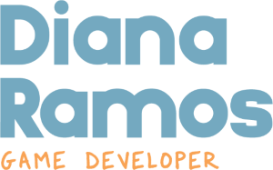

#  Hi, I'm Diana Ramos (Dinorekkos)
**Game Developer | Multiplayer Game Programmer | Technical Game Producer**

I’m a game programmer specialized in **mobile, multiplayer, backend systems and VR**, with experience on taking games **from development to full release**. I work mainly with **Unity** c:

## 🔥 MY HIGHLIGHTS

-  **Multiplayer and backend networking experience**

- **Mobile development**
- **VR development**

- **Experience working with international teams & clients**

---
## 🧰 Tech Stack

**Game Engines**  
Unity · Unreal Engine  

**Multiplayer & Backend**  
Unity Services · Fishnet · Playflow Servers · Cloud Code · Node.js

**Tools**  
Git · Rider · VS Code · Notion · Asana  

---

## 🌍 Languages
- Spanish (Native)
- English (Advanced)

---

📫 **Contact**  
[LinkedIn](https://linkedin.com/in/dianargamedev) · dianaramosgd@gmail.com
